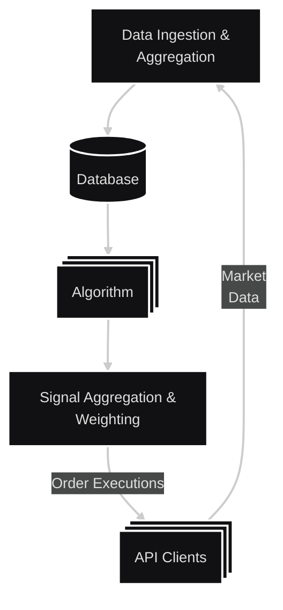

# pachamama

Algorithmic trading on [Alpaca](https://alpaca.markets/), name is from [Wikipedia article on Alpacas](https://en.wikipedia.org/wiki/Alpaca):
> Alpacas are closely tied to cultural practices for Andeans people. Prior to colonization, the image of the alpaca was used in rituals and in their religious practices. Since the people in the region depended heavily on these animals for their sustenance, the alpaca was seen as a gift from Pachamama.

